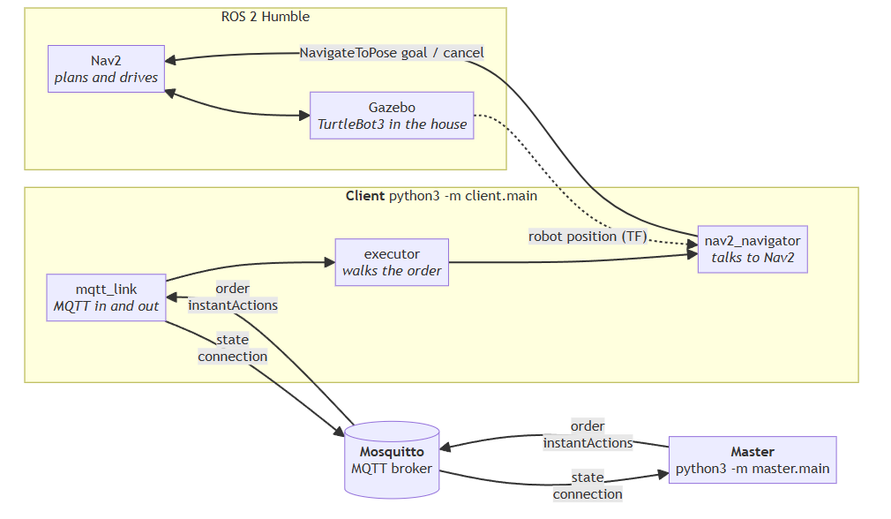
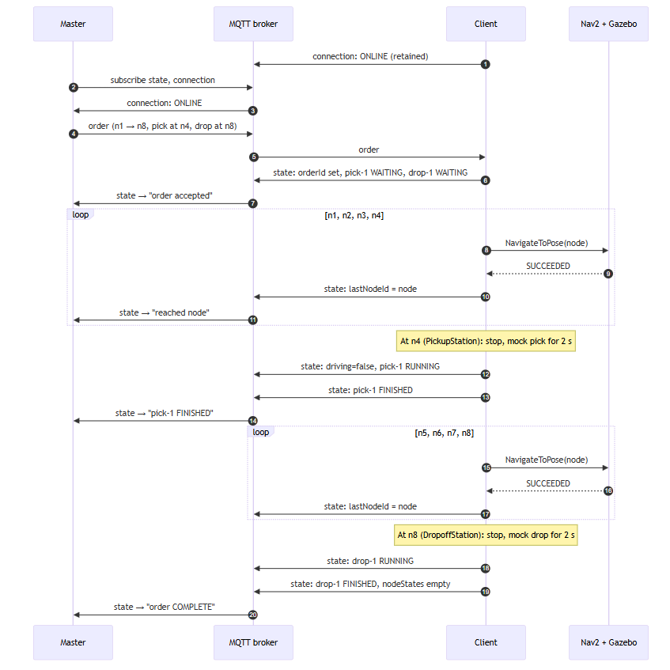
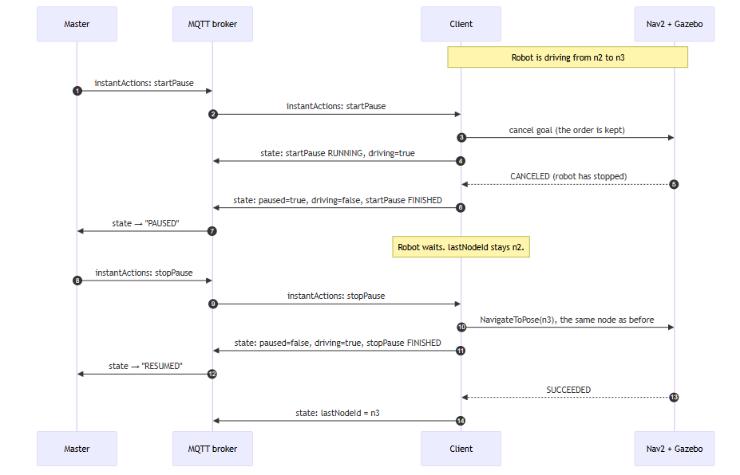

# VDA5050 Master and Client for a Simulated TurtleBot3

Two Python programs that talk to each other only over MQTT, using the
[VDA5050 v2.1.0](https://github.com/VDA5050/VDA5050/tree/2.1.0) message format:

- **Master** (`master/`): plays the fleet manager. Sends an order, can pause and
  resume the robot, and prints what the robot is doing.
- **Client** (`client/`): plays the robot. Receives the order, drives a simulated
  TurtleBot3 through ROS 2 Nav2 node by node, fakes the pick and drop, and reports
  its state back.

The demo order: go to **PickupStation**, **pick** a cart, go to **DropoffStation**,
**drop** the cart. The robot can be paused mid-drive and resumed.

---

## Contents

1. [Architecture](#1-architecture)
2. [Message flow: one full order](#2-message-flow-one-full-order)
3. [Message flow: pause and resume](#3-message-flow-pause-and-resume)
4. [Install](#4-install)
5. [Run](#5-run)
6. [Test](#6-test)
7. [Map and order](#7-map-and-order)
8. [Simplifications and trade-offs](#8-simplifications-and-trade-offs)
9. [Known issues (WSL2)](#9-known-issues-wsl2)

---

## 1. Architecture



**How to read it**

- The master and client never talk directly. Everything goes through the MQTT broker.
- Both programs import the same small package, `vda5050/`, for topic names, message
  headers and message builders. That package is the shared contract, so the two
  sides can't disagree about the format.
- Inside the client there are three layers, each with one job:

| Layer | Knows about | Job |
|---|---|---|
| `mqtt_link.py` | MQTT only | Receive `order` and `instantActions`; send `state` and `connection` |
| `executor.py` | Neither MQTT nor ROS | Walk the order node by node, run pick and drop, pause and resume |
| `nav2_navigator.py` | ROS 2 only | Send each node to Nav2 as a goal; read the robot's position |

Because the executor knows nothing about MQTT or ROS, it can be tested in
milliseconds with a fake robot (`client/navigator.py`, `SimulatedNavigator`).

### MQTT topics

All topics follow the VDA5050 pattern `uagv/v2/<manufacturer>/<serialNumber>/<topic>`.
Here that is `uagv/v2/robotis/tb3_waffle_01/<topic>`.

| Topic | From → To | What it carries | QoS | Retained |
|---|---|---|---|---|
| `order` | Master → Client | The route (nodes, edges) and the pick/drop actions | 0 | no |
| `instantActions` | Master → Client | `startPause` / `stopPause` | 0 | no |
| `state` | Client → Master | Where the robot is and what it is doing, every 1 s and on every change | 0 | no |
| `connection` | Client → Master | `ONLINE`, `OFFLINE` or `CONNECTIONBROKEN` | 1 | yes |

**Connection and "last will".** When the client connects, it tells the broker:
"if I disappear without saying goodbye, publish `CONNECTIONBROKEN` for me". Then it
publishes `ONLINE`. On a clean shutdown (Ctrl+C) it publishes `OFFLINE`. Because
these messages are *retained*, a master that starts later still sees the latest status.

---

## 2. Message flow: one full order



**How the master knows the order is complete.** VDA5050 has no "order done"
message. The master works it out from the state: no nodes left (`nodeStates` is
empty), not driving, and every action `FINISHED`.

**How a node counts as reached.** When Nav2 reports `SUCCEEDED` (within its 0.25 m
goal tolerance), the client removes the node from `nodeStates`, sets `lastNodeId`,
and only then runs that node's actions.

---

## 3. Message flow: pause and resume



**Why `startPause` is `RUNNING` first.** The spec says the pause is finished when the
vehicle stands still. Cancelling a Nav2 goal is a request, and the robot takes a
moment to stop. So the client waits for Nav2 to confirm `CANCELED` before it reports
`paused: true`.

**If the robot is picking or dropping when paused**, that action becomes `PAUSED` and
keeps its remaining time. On resume it finishes the rest.

---

## 4. Install

Tested on **Windows 11 + WSL2 + Ubuntu 22.04**. A native Ubuntu 22.04 machine works
the same way. Skip the WSL step.

**1. Ubuntu 22.04 in WSL2** (Windows only, in an Administrator PowerShell, then reboot):

```bash
wsl --install -d Ubuntu-22.04
```

Everything below runs **inside Ubuntu**.

**2. ROS 2 Humble apt repository:**

```bash
sudo apt update && sudo apt install -y software-properties-common curl
sudo add-apt-repository universe -y
sudo curl -sSL https://raw.githubusercontent.com/ros/rosdistro/master/ros.key -o /usr/share/keyrings/ros-archive-keyring.gpg
echo "deb [arch=$(dpkg --print-architecture) signed-by=/usr/share/keyrings/ros-archive-keyring.gpg] http://packages.ros.org/ros2/ubuntu jammy main" | sudo tee /etc/apt/sources.list.d/ros2.list
sudo apt update
```

**3. ROS 2, Gazebo, Nav2, TurtleBot3 and the Mosquitto MQTT broker:**

```bash
sudo apt install -y ros-humble-desktop ros-humble-gazebo-ros-pkgs \
  ros-humble-navigation2 ros-humble-nav2-bringup \
  ros-humble-turtlebot3 ros-humble-turtlebot3-gazebo ros-humble-turtlebot3-navigation2 \
  ros-humble-turtlebot3-cartographer ros-humble-turtlebot3-teleop \
  mosquitto mosquitto-clients python3-pip
```

Mosquitto starts automatically as a service on port 1883.

**4. Environment** (add to `~/.bashrc`, then open a new terminal):

```bash
source /opt/ros/humble/setup.bash
export TURTLEBOT3_MODEL=waffle
export GAZEBO_MODEL_PATH=$GAZEBO_MODEL_PATH:/opt/ros/humble/share/turtlebot3_gazebo/models
export ROS_DOMAIN_ID=30
export QT_QPA_PLATFORM=xcb   # WSL2 only: without this, Gazebo/RViz windows never appear
```

**5. This repo and its Python packages:**

```bash
git clone https://github.com/tobiasceg/robotics_take_home.git
cd robotics_take_home
python3 -m pip install --user -r requirements.txt
```

**6. The map** (Nav2 loads it from here):

```bash
mkdir -p ~/maps && cp maps/house_map.pgm maps/house_map.yaml ~/maps/
```

---

## 5. Run

Open one terminal per step. Run the Python commands from the repo root.

**Terminal 1: the simulator.** Wait for the Gazebo window. The very first launch can
take a few minutes (see [Known issues](#9-known-issues-wsl2)).

```bash
ros2 launch turtlebot3_gazebo turtlebot3_house.launch.py
```

**Terminal 2: Nav2 with the map.** RViz opens.

```bash
ros2 launch turtlebot3_navigation2 navigation2.launch.py use_sim_time:=True map:=$HOME/maps/house_map.yaml
```

In RViz, click **2D Pose Estimate**, then click on the robot and drag in the direction
it faces. The red laser dots should line up with the walls. The client can't know
where the robot is until this is done.

**Terminal 3: the client.**

```bash
python3 -m client.main
```

**Terminal 4: the master sends the order** and prints progress until it finishes:

```bash
python3 -m master.main order orders/pickup_dropoff.json
```

**Terminal 5: pause and resume** while the robot is driving between two nodes:

```bash
python3 -m master.main pause
python3 -m master.main resume
```

### What you should see

Terminal 4, from a real run (shortened) with a pause and resume on the edge n2 → n3:

```
19:09:17  sent order order-001-190916: n1 -> n2 -> ... -> n8 (pick at n4, drop at n8)
19:09:17  order order-001-190916 accepted
19:10:26  reached n2 at (0.03, 1.32), 6 nodes left
19:10:30  PAUSED
19:10:30  startPause-191029 (startPause) FINISHED
19:10:53  RESUMED
19:11:01  reached n3 at (0.90, -0.20), 5 nodes left
19:11:15  reached n4 at (2.60, -0.94), 4 nodes left
19:11:15  pick-1 (pick) RUNNING
19:11:17  pick-1 (pick) FINISHED
19:12:33  reached n8 at (3.87, 4.58), 0 nodes left
19:12:35  drop-1 (drop) FINISHED
19:12:35  order order-001-190916 COMPLETE at n8, battery 91.3%
```

Terminal 5:

```
19:10:29  startPause-191029 RUNNING: paused=False, driving=True, lastNodeId=n2
19:10:29  startPause-191029 FINISHED: paused=True, driving=False, lastNodeId=n2
19:10:52  stopPause-191052 FINISHED: paused=False, driving=True, lastNodeId=n2
```

To see the raw VDA5050 messages as they pass through the broker:

```bash
mosquitto_sub -v -t 'uagv/v2/robotis/tb3_waffle_01/#'
```

### Command reference

| Command | What it does |
|---|---|
| `python3 -m client.main` | Start the robot-side client (needs Nav2 running) |
| `python3 -m client.main --fake-nav` | Start the client with a fake straight-line robot, no ROS needed |
| `python3 -m master.main order <file>` | Send an order with a new unique `orderId`, follow it to the end |
| `python3 -m master.main pause` / `resume` | Send `startPause` / `stopPause` and wait for the result |
| `python3 -m master.main watch` | Just print what the robot is doing |

Master exit codes: `0` success, `1` rejected or failed, `2` robot not reachable.

---

## 6. Test

**Unit tests** (no simulator, no broker needed), 34 tests:

```bash
python3 -m pytest -q
```

| Test file | Checks |
|---|---|
| `tests/test_contract.py` | Every message the shared package builds passes the **official VDA5050 JSON schema**; the order file is valid |
| `tests/test_executor.py` | Full order, standing still during pick, nodes and edges removed as they are reached, Nav2 failure, busy robot rejects a second order, invalid orders |
| `tests/test_pause.py` | Pause while driving, while picking, while idle; resume goes to the same node; paused time doesn't count |
| `tests/test_monitor.py` | The master's view: states produced by the real executor are turned into the right events |

The official schemas are in `schemas/vda5050_v2.1.0/`, copied from the VDA5050
repository (MIT licence).

**Without the simulator.** The whole MQTT flow works with the fake robot. Only
Mosquitto is needed:

```bash
python3 -m client.main --fake-nav                        # terminal 1
python3 -m master.main order orders/pickup_dropoff.json  # terminal 2
python3 -m master.main pause                             # terminal 3, then resume
```

---

## 7. Map and order

There are two different maps.

| | Occupancy map | LIF map |
|---|---|---|
| File | `maps/house_map.pgm` + `.yaml` | `maps/house.lif.json` |
| What it is | A picture of walls and free floor | Named nodes, edges between them, and stations |
| Made with | SLAM (cartographer), driving the robot around | The [VDA5050 LIF Editor](https://github.com/bekirbostanci/vda5050_lif_editor) |
| Used by | Nav2, to plan routes and locate the robot | The order, to say where to go |

**Making the LIF line up with Nav2.** The occupancy map image was loaded into the LIF
editor as the background, placed using the map's own origin and scale (x -6.63, y -7.96,
18.5 m × 18.6 m). The editor anchors the image at its bottom-left corner. This was
checked by clicking two far-apart corners in RViz (`/clicked_point`) and confirming
they land on the same spots in the editor.

**The route.** Nodes `n1` to `n8`. `n1` is where the robot spawns. **PickupStation is
`n4`** and **DropoffStation is `n8`**. `python3 tools/check_lif.py` checks that the
stations point at real nodes, the edges connect, and every node is clear of walls.

**The order** (`orders/pickup_dropoff.json`) covers the four phases:

| Phase | In the order |
|---|---|
| 1. Go to PickupStation | drive n1 → n2 → n3 → n4 |
| 2. Pick up cart | `pick` action on n4 |
| 3. Go to DropoffStation | drive n4 → n5 → n6 → n7 → n8 |
| 4. Drop off cart | `drop` action on n8 |

The LIF has no headings, so each node's `theta` points toward the next node. The robot
then doesn't spin on the spot at every stop.

---

## 8. Simplifications and trade-offs

**Parts of the spec left out** (all marked out of scope by the assignment):

- Order updates, the horizon and `newBaseRequest` (6.6.2, 6.10.3). One complete order at a time.
- `cancelOrder` (6.6.3), map management (6.7), and every action except `pick`, `drop`, `startPause`, `stopPause` (6.8).
- Action blocking types (6.12). Actions run one at a time while the robot stands still.
- The `visualization` and `factsheet` topics (6.13, 6.15) and the `info` array (6.10.4).

**Simplifications in what is built:**

| Area | What I did | Why |
|---|---|---|
| Pick and drop | A 2 s wait and a log line. No `loads` reported | Assignment says to mock it |
| First node | The robot drives to it, instead of rejecting an order it isn't already on | Easier to rerun the demo from anywhere |
| Busy robot | A second order while one is running is rejected with `orderError` | No order updates |
| Same order sent twice | Ignored (same `orderId` + `orderUpdateId`), even after it finished, per spec 6.6 | So the master gives every send a new `orderId` |
| Routes | Only a straight chain: edge *i* joins node *i* and *i+1* | That's what a VDA5050 order is; anything else → `orderError` |
| Node reached | When Nav2 says `SUCCEEDED` (its 0.25 m tolerance) | Instead of the spec's `allowedDeviationXY/Theta` |
| Nav2 fails | `navigationFailed` error, remaining actions `FAILED`, robot free for a new order | Simple and visible to the master |
| Pause during pick/drop | The action is paused too | The spec contradicts itself: 6.8.2 says actions "can continue", 6.8.3 says "all actions will be paused" |
| Pause twice / resume when not paused | Harmless, reported `FINISHED` | Nothing to undo |
| Extra state fields | Filled with fixed values (`operatingMode: AUTOMATIC`, `eStop: NONE`, ...) | The official schema requires them |
| State rate | On every change and at least every 1 s | Spec requires at least every 30 s; 1 s is easier to watch |
| Battery | Fake, drains slowly, never charges | Assignment allows it |
| Master | A command-line tool for one robot | It stands in for a fleet manager, it isn't one |

**Two things I'd improve with more time:**

- The first leg to `n1` can take ~30 s even though the robot starts there, because Nav2
  must line up exactly with n1's position and heading. The client could treat "already
  within tolerance" as reached.
- `n5` is ~0.35 m from a wall, inside Nav2's safety margin, and the leg after it is
  sometimes slow. Moving n5 further from the wall would help.

---

## 9. Known issues (WSL2)

| Symptom | Cause | Fix |
|---|---|---|
| Gazebo/RViz shows in the taskbar but the window never opens | Under WSLg, Qt apps pick Wayland, which doesn't present the window | `export QT_QPA_PLATFORM=xcb` |
| Robot missing on the very first launch; log says spawn service unavailable | First load of the house meshes takes ~3 min, and the launch file waits only 30 s | Launch again; later launches are fast |
| House looks rotated in the map compared with Gazebo | SLAM started after the robot had already moved, so the map frame ≠ the Gazebo world frame | Nothing to fix: Nav2, the LIF and the order all use the map frame |
| Open yard around the house shows as unknown (grey) on the map | The laser reaches 3.5 m; beams that hit nothing only weakly mark floor as free | Unknown isn't blocked. The robot still drives there (n1 is out there) |

The diagrams are PNG images in `docs/diagrams/`. Each has its Mermaid source next to it
(`.mmd`), which can be edited and re-rendered, e.g. at https://mermaid.live.

A step-by-step guide to milestone 1 (simulation, SLAM mapping, first Nav2 goal) is in
[docs/milestone1_walkthrough.md](docs/milestone1_walkthrough.md).
